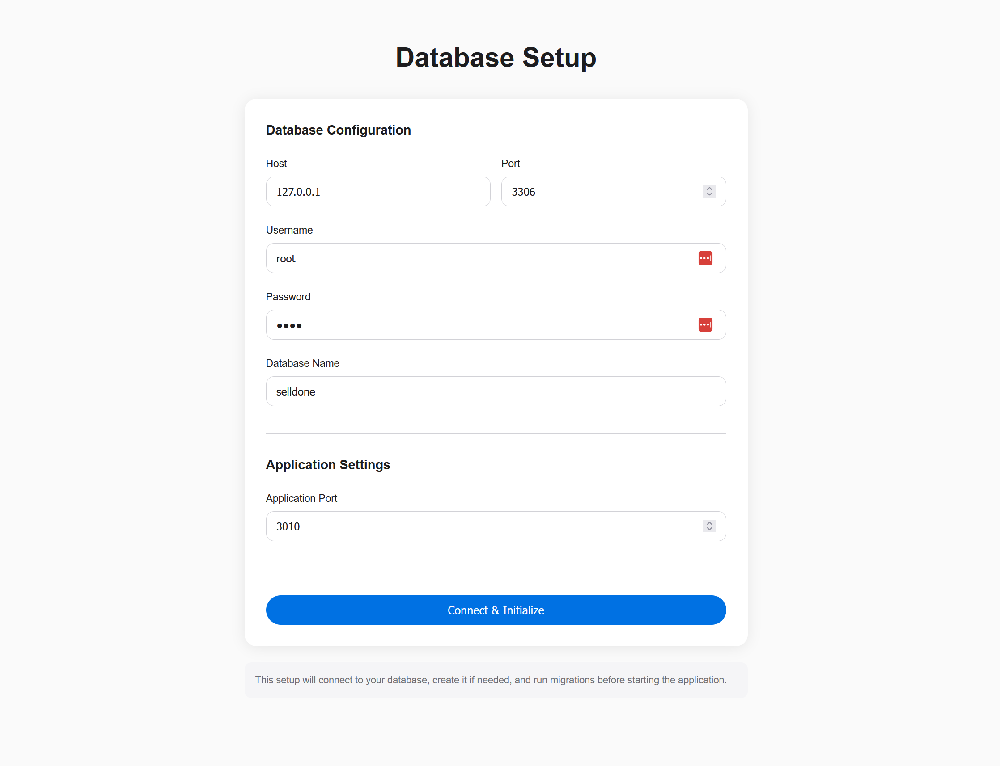
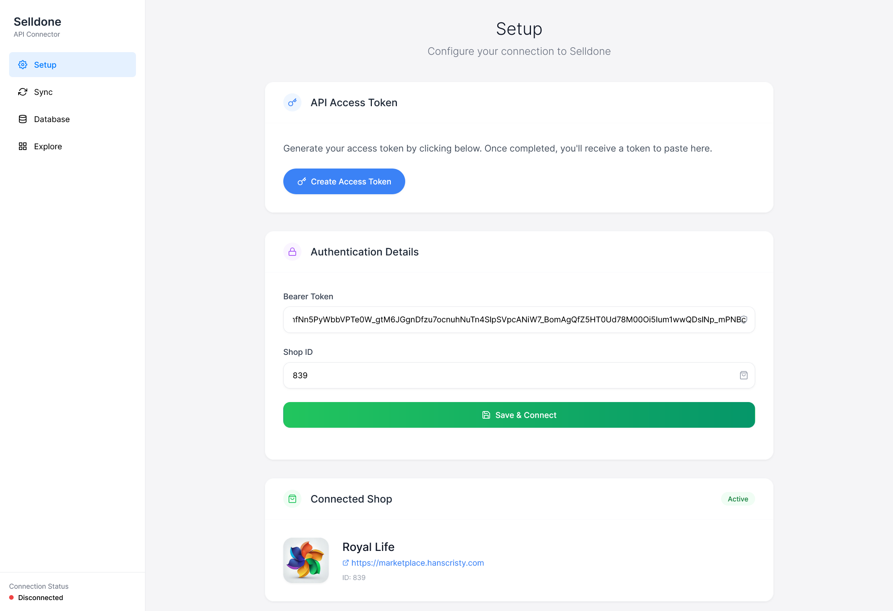
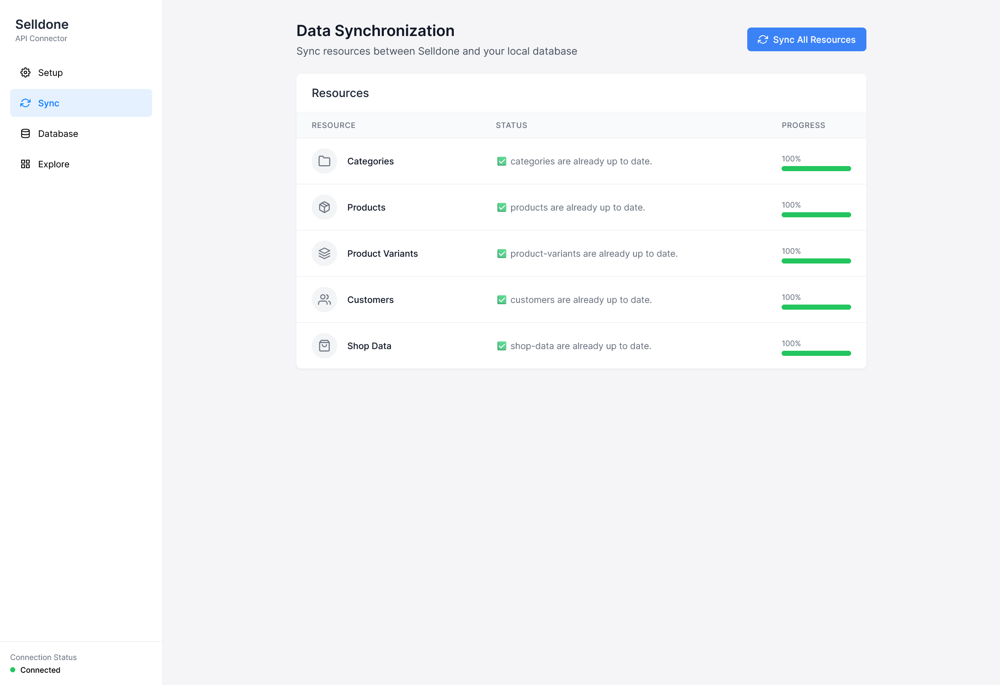
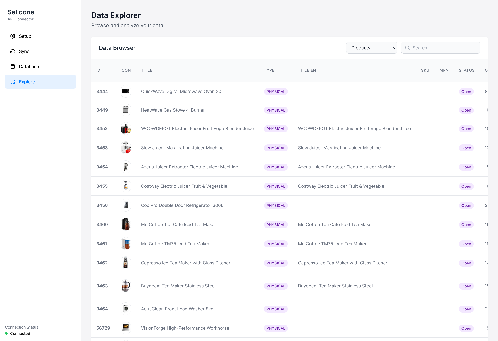
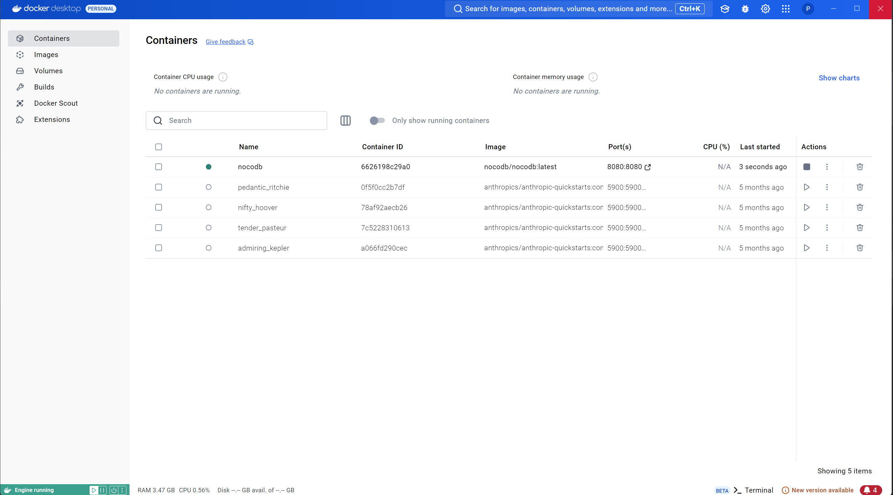
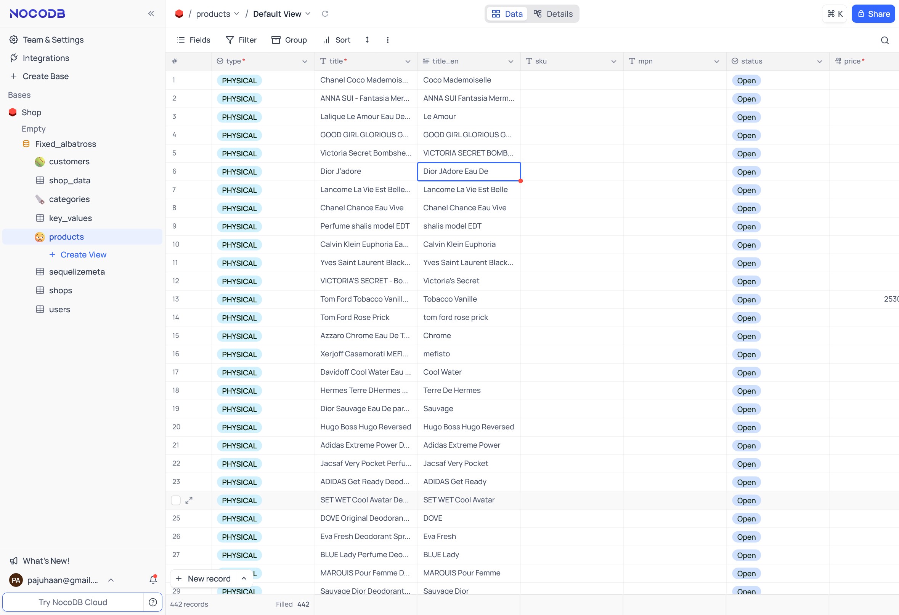

# Clone Sheet - Have Your Business Data on Your Device


[](https://github.com/selldone/clone-sheet)
[](https://www.npmjs.com/package/@selldone/clone-sheet)
[](https://www.npmjs.com/package/@selldone/clone-sheet)
[](https://www.typescriptlang.org/)

Clone Sheet is a tool that allows you to create a clone of your store's data from [Selldone](https://selldone.com) into
an SQL database (MariaDB or MySQL). This data can then be used for AI automation, accounting migrations, or integration
with other software solutions.

## Features

- Clones store data from Selldone into a structured SQL database.
- Supports MariaDB and MySQL.
- Can be used for AI automation, data migration, or business analytics.
- Provides a simple setup and user-friendly interface.

---

## Step 1. Database Setup

To use Clone Sheet, you need to set up a MariaDB or MySQL database. You can install MariaDB on Windows, macOS, or Linux
by following this link:

[Download MariaDB](https://mariadb.org/download/?t=mariadb)

---

## Step 2. Clone Project

Clone the repository to your local machine using one of the following methods:

### Using HTTPS:

```bash
git clone https://github.com/selldone/clone-sheet.git
cd clone-sheet
npm install
```

### Using SSH:

```bash
git clone git@github.com:selldone/clone-sheet.git
cd clone-sheet
npm install
```

### Using GitHub CLI:

```bash
gh repo clone selldone/clone-sheet
cd clone-sheet
npm install
```

Once cloned, you'll have the complete project files on your local machine with all dependencies installed and ready for the next step.

---

## Step 3. Installation & Setup

### 1. Configure the Database

Define the database host (local or remote). The setup process will create the necessary database (if it does not already
exist) and update the `.env` configuration file.

Run the setup script:

```bash
node setup.js
```



---

### 2. Start the Server

The server will run on `http://localhost:3010` or another available port, providing access to the cloned data.

Start the server:

```bash
npm start
```

---

## Usage

### 1. Create Access Token

Click on the **Create Access Token** button, which will redirect you to Selldone. Select your shop, copy the **Access
Token** and **Shop ID**, and enter them in the form.

Click **Save & Connect**.



### 2. Sync Data

You can view available data sources and sync data accordingly.



### 3. Explore Data

Access and explore cloned data in the **Explorer** tab.



---

## Visualizing Data with NocoDB

To visualize the cloned data, you can use [NocoDB](https://www.nocodb.com/), an open-source database browser.

### Setup NocoDB via Docker:

```bash
docker run -d \
  --name noco \
  -v "$(pwd)"/nocodb:/usr/app/data/ \
  -p 8080:8080 \
  nocodb/nocodb:latest
```


Now you can open NocoDB in your browser at `http://localhost:8080`.

Once running, set the SQL host to `host.docker.internal` and port `3306` (or the correct port for your database).


---

## Done!

Your store data is now cloned, and you can use it for your automation, reporting, or integrations.

## Why Clone Your Data Locally?

| Category                  | Use Cases                                                                                                                                                                                                               |
|---------------------------|-------------------------------------------------------------------------------------------------------------------------------------------------------------------------------------------------------------------------|
| **Advanced Analytics**    | • Connect to Power BI, Tableau, or Google Data Studio for custom dashboards<br>• Execute complex SQL queries to uncover hidden business trends<br>• Perform cohort analysis and customer lifetime value calculations    |
| **Custom Automation**     | • Create sophisticated marketing campaigns based on purchase patterns<br>• Build personalized discount strategies for different customer segments<br>• Set up alerts and actions based on inventory or sales thresholds |
| **AI Integration**        | • Train ML models on historical data to predict future sales trends<br>• Use MCP Cluda or OpenAI to generate insights from business data<br>• Develop recommendation engines based on actual customer behavior          |
| **System Integration**    | • Connect seamlessly with QuickBooks, Xero or other accounting software<br>• Sync customer profiles with HubSpot, Salesforce or other CRMs<br>• Integrate with ERP systems for streamlined operations                   |
| **Data Sovereignty**      | • Maintain complete control over your business information<br>• Keep secure, redundant backups of critical business data<br>• Implement custom security protocols for sensitive information                             |
| **Custom Reporting**      | • Generate tailored reports for stakeholders and investors<br>• Schedule automated exports in various formats (PDF, Excel, CSV)<br>• Create visualizations focused on your specific KPIs                                |
| **Developer Flexibility** | • Build custom microservices around your business data<br>• Test new features without affecting production environment<br>• Develop mobile apps with customized data access layers                                      |


**🔥 We are developing this project actively...**